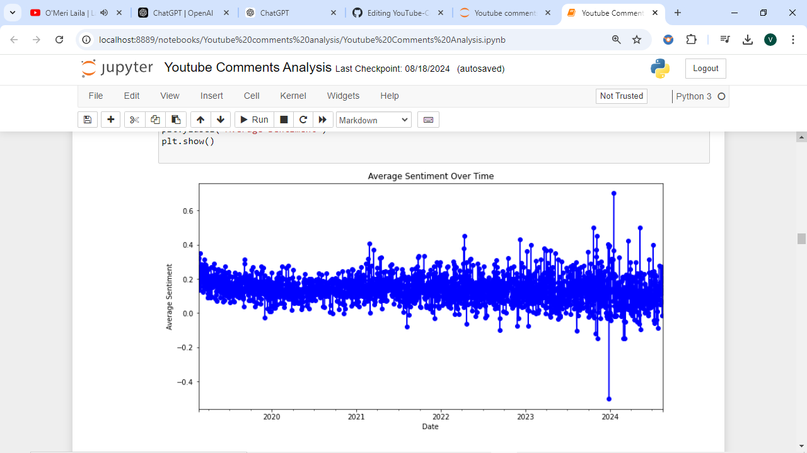
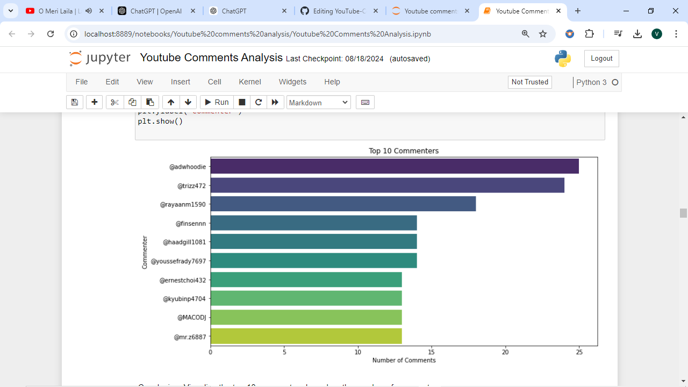
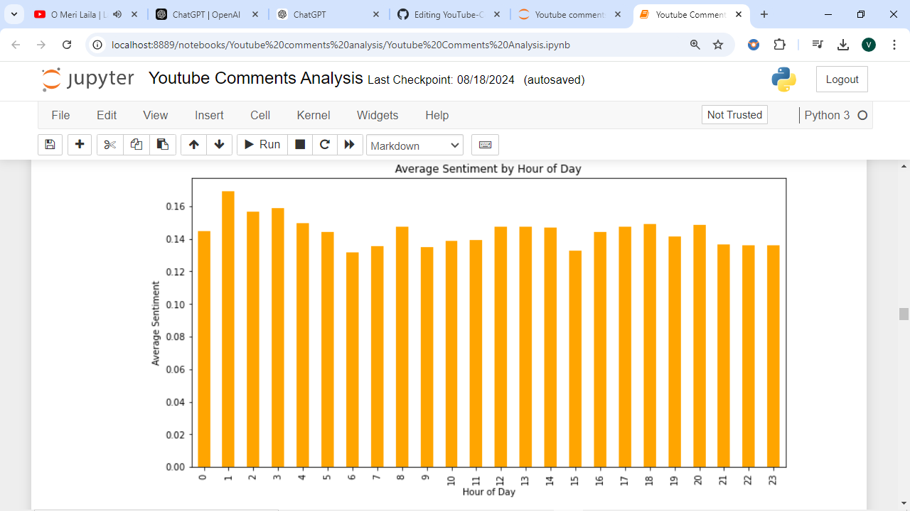
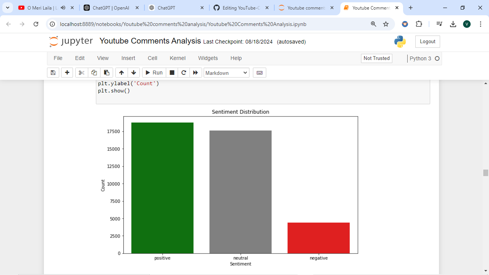
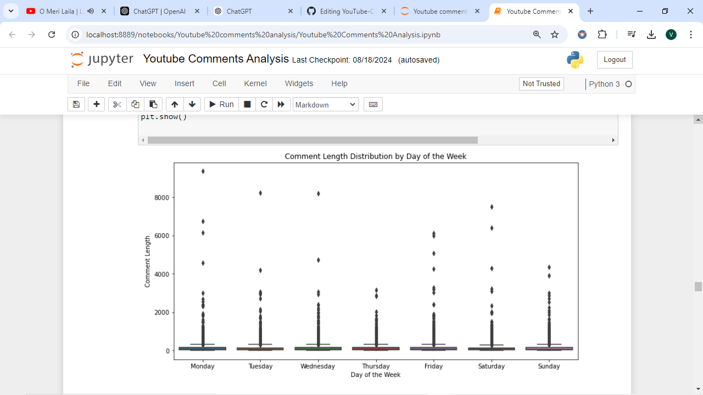

# YouTube Comments Sentiment Analysis

This project performs sentiment analysis on YouTube comments to extract meaningful insights and visualize trends. Using Python, the YouTube Data API, and various data visualization libraries, this analysis provides an understanding of comment sentiment, commenter activity, and time-based patterns.

## Objectives
- **Sentiment Analysis**: Determine the sentiment (positive, negative, neutral) of YouTube comments.
- **Time-based Patterns**: Explore how sentiment and comment activity change over time.
- **Data Visualization**: Create visualizations to illustrate findings and trends.

## Dataset
- **Source**: Comments are retrieved dynamically using the [YouTube Data API](https://developers.google.com/youtube/v3).
- **Fields**: Comment text, timestamp, commenter name.

You provide the YouTube video ID, and the script fetches the comments in real-time for analysis.

## Installation

To run this project locally, install the required libraries by running:
pip install google-api-python-client pandas nltk wordcloud matplotlib textblob seaborn

## Usage
1. **API Key Setup**: Ensure you have a valid [YouTube Data API Key](https://console.developers.google.com/).
2. **Run the Analysis**: Execute the provided Jupyter Notebook to fetch comments and perform sentiment analysis.
   - In `notebook.ipynb`, enter the video ID for which you want to analyze the comments.

## Project Structure

```plaintext
📁 YouTube-Comments-Sentiment-Analysis
│
├── Youtube Comments Analysis.ipynb # Jupyter Notebook containing the analysis and visualizations.
├── youtube_comments.csv          # (Auto-generated) Raw data of YouTube comments.
├── youtube_comments_with_sentiment.csv  # (Auto-generated) Data with sentiment analysis results.
├── images/                       # Folder containing images of visualizations.
├── README.md                     # Project README file.
```

## Key Visualizations

### 1. Sentiment Over Time
A line plot showing the average sentiment of comments over time, illustrating trends and fluctuations.



### 2. Top Commenters
A bar plot displaying the top 10 commenters by the number of comments, highlighting the most active users.



### 3. Average Sentiment by Hour of Day
A bar plot showing the average sentiment of comments by hour of the day, revealing how sentiment varies throughout the day.



### 4. Sentiment Distribution
A bar plot illustrating the distribution of comment sentiments (positive, negative, neutral), providing a breakdown of overall sentiment.



### 5. Comment Length Distribution by Day of the Week
A box plot showing the distribution of comment lengths across different days of the week, indicating variations in comment size based on the day.



## Future Work
- **Advanced Sentiment Analysis**: Explore more sophisticated sentiment analysis techniques (e.g., using deep learning models like BERT).
- **Feature Expansion**: Integrate additional features such as video view counts, like/dislike ratios, and keyword analysis.
- **Extended Dataset**: Analyze comments from a wider range of videos for more comprehensive insights.

## Acknowledgments
- [Google YouTube Data API](https://developers.google.com/youtube/v3)
- [TextBlob](https://textblob.readthedocs.io/en/dev/)
- [WordCloud](https://github.com/amueller/word_cloud)
- [Matplotlib](https://matplotlib.org/)
- [Seaborn](https://seaborn.pydata.org/)
